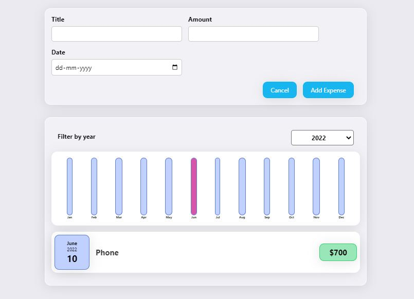

# Expense-Tracker

### Dependencies

<ul>
    <li> 
        <a href="https://reactjs.org/" >React JS</a>
    </li>
</ul>

In the project directory, install node:

### `npm install`

To run the server:

### `npm start`

To run app in your browser:

### `http://localhost:3000/`

#### Result

### `npm test`

Launches the test runner in the interactive watch mode.\
See the section about [running tests](https://facebook.github.io/create-react-app/docs/running-tests) for more information.

### `npm run build`

Builds the app for production to the `build` folder.\
It correctly bundles React in production mode and optimizes the build for the best performance.

The build is minified and the filenames include the hashes.\
Your app is ready to be deployed!